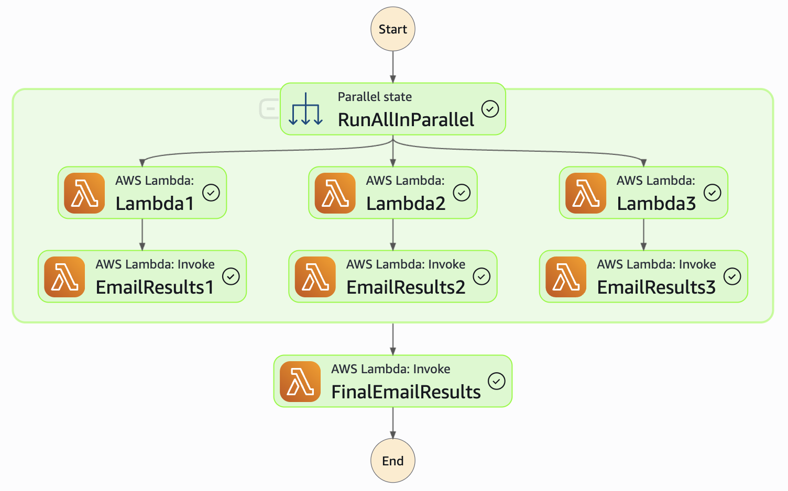

# Terraform based DevOps Scheduled Lambdas 

This project uses Terraform to define and deploy a scheduled Step Function that triggers lambdas for DevOps purposes. The goal is to enable quick and easy deployment of new lambdas used in DevOps. Each lambda will be run in parallel and have an output step to notify of the results as shown here:

## Useful commands
* `brew tap hashicorp/tap`                  get official terraform via homebrew
* `brew install hashicorp/tap/terraform`    get official terraform via homebrew

* `terraform init`                  once per account, or to refresh dependencies in .terraform.lock.hcl

* `terraform validate`              check syntax
* `terraform fmt`                   apply formatting

* `terraform apply -auto-approve`   deploy updates to AWS
